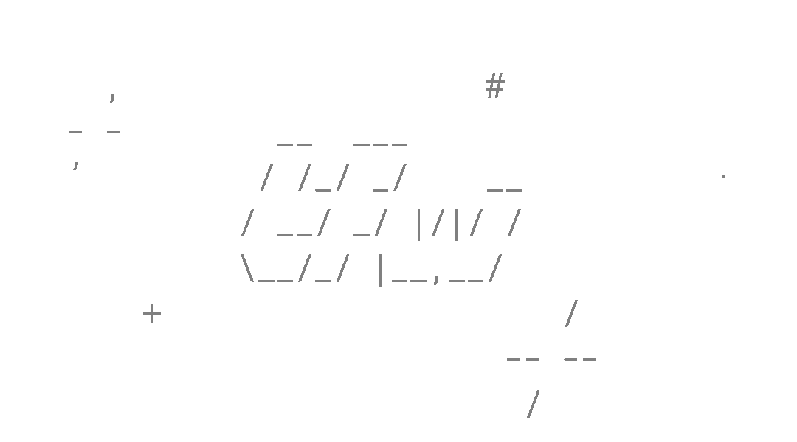

<p align="center">
  
</p>

# tfw

`tfw` is a command-line tool for managing a collection of timestamped, [`gpg`](https://gnupg.org/)-encrypted journal entries. It provides a simple, trustless and future-proof way of storing your private thoughts, ideas, memories, etc.

The way it works was largely inspired by [`pass`](https://www.passwordstore.org/)—a simple password manager that follows the [Unix philosophy](https://en.wikipedia.org/wiki/Unix_philosophy).

## How it works

The entries are simply `gpg`-encrypted plain text files stored in a directory. Each file has a name that conforms to the [ISO-8601](https://en.wikipedia.org/wiki/ISO_8601) (basic) date format. Encryption and decryption happens on the fly where possible, otherwise the script makes use of [tmpfs](https://en.wikipedia.org/wiki/Tmpfs) to prevent unencrypted secrets from touching persistent storage. On systems where tmpfs is not available, `tfw` will try to [shred](https://en.wikipedia.org/wiki/Shred_(Unix)) temporary files before deletion (read about its limitations [here](https://en.wikipedia.org/wiki/Shred_(Unix)#Limitations)).

A number of useful subcommands is provided for common tasks such as listing, viewing, editing, grepping, etc., combined with powerful selectors and filters.

## Dependencies

The script depends on [GnuPG](https://gnupg.org/) for encryption.

## Installation

Get the [latest release](https://github.com/climech/tfw/releases), change into the directory, and run:

```
$ make && sudo make install
```

The `make` command is used to insert the current version number into the script; `make install` also installs Bash completion.

## Usage

### Selectors

Most `tfw` commands expect a selector. Entries can be selected using index selectors, date selectors and index/date ranges.

#### Index selectors

Index selectors work on a list of entries ordered chronologically. Index `1` selects the oldest entry available. Negative indices may be used to count from the end of the list, e.g. to list the most recent entry:

```
$ tfw ls -1

42. Tue 14 Jul 2020 07:43:27 PM CEST
```

Multiple selectors work too:

```
$ tfw ls 1 4 -1

1.  Tue 31 Dec 2019 03:12:22 PM CEST
4.  Fri  3 Jan 2020 09:13:49 PM CEST
42. Tue 14 Jul 2020 07:43:27 PM CEST
```

#### Date selectors

A date selector is a string that follows the format `YYYY-MM-DD`. It selects all entries created on the specified date.

```
$ tfw ls 2019-12-31

1. Tue 31 Dec 2019 03:12:22 PM CEST
2. Tue 31 Dec 2019 03:44:01 PM CEST
```

#### Ranges

Multiple entries may be selected by specifying a range:

```
$ tfw ls 1:4

1. Tue 31 Dec 2019 03:12:22 PM CEST
2. Tue 31 Dec 2019 03:44:01 PM CEST
3. Thu  2 Jan 2020 02:02:58 PM CEST
4. Fri  3 Jan 2020 09:13:49 PM CEST

$ tfw ls 2020-01-01:2020-02-01

3. Thu  2 Jan 2020 02:02:58 PM CEST
4. Fri  3 Jan 2020 09:13:49 PM CEST
...
```

Either boundary may be omitted, creating an unbounded range in either direction. To select the 5 most recent entries:

```
$ tfw ls -5:
```

Omitting both parts (`:`) selects all entries.

### Filters

(TODO)

### List of commands

#### init \<gpg-id\>

Initialize the program by setting the GPG key. Any existing entries are re-encrypted using the new key.

```
$ tfw init "John Doe"
```

#### new

Open the `$EDITOR` to create a new entry. The entry is created on exit, if the file was saved. The command is invoked implicitly when no command is given.

#### list|ls [\<selector\>...]

Print out a list of selected entries. If no selector is given, all entries are selected.

```
$ tfw ls

1. Tue 31 Dec 2019 08:12:22 PM CEST
2. Tue 31 Dec 2019 03:44:01 PM CEST
...
```

#### cat \<selector\>...

Decrypt, concatenate and print out selected entries.

#### view \<selector\>...

Decrypt selected entries and pipe them into `less` for easy reading.

The entries are concatenated and wrapped to fit the current terminal width, capped at 80 characters. Each entry begins with a header showing the creation time.

#### edit \<index\>

Open the `$EDITOR` to edit the selected file. The entry is updated on exit, if the file was saved.

#### grep \<grep-args\> [\<selector\>...]

Decrypt selected entries and pipe them into `grep`. When no selector is given, all entries are searched.

```
$ tfw grep -i dolor 1

1. Tue 31 Dec 2019 03:12:22 PM CEST
Lorem ipsum [dolor] sit amet, consectetur adipiscing elit. Proin et ligula orci.
ante elementum [dolor], quis faucibus tortor risus vel sem. Aliquam varius
```

#### remove|rm \<selector\>...

Remove the selected entries. Uses [trash-cli](https://github.com/andreafrancia/trash-cli/) if installed, otherwise permanently deletes the file. Prompts for confirmation when attempting to remove multiple entries.

**NOTE:** The indices are not IDs. When an entry is removed from the list, the entry immediately following it takes its place. When in doubt, run `ls` again before removing more entries.

#### help

Display helpful information about the commands.

#### version

Display program version.

## TODO

* Improve completion;
* Write completion for other shells besides Bash;
* Add filters (`year:2020`, `weekday:friday`, etc., applied to current selection);

## License

This project is released under the [MIT license](https://en.wikipedia.org/wiki/MIT_License).
